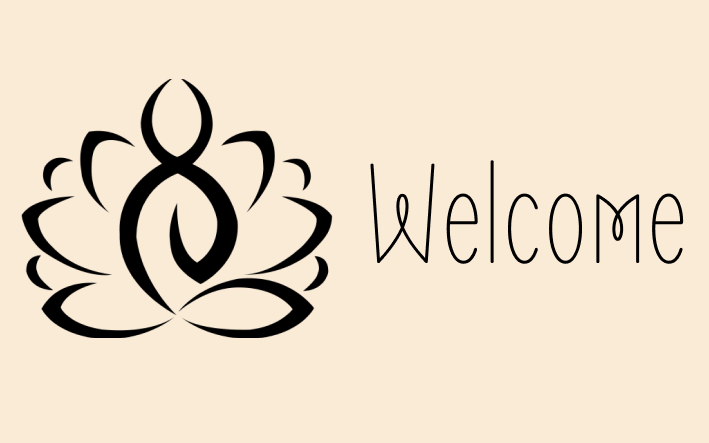

[www.immanuelcurrah.com](https://www.immanuelcurrah.com/)

## Mission Statement

As a previous zen monk with over 15 years of experience in construction, I bring a diverse and user-centered approach to software engineering. My skills and experience allow me to seamlessly take feedback and improve my code, while also asking questions when needed. Paired with a love of technology, I also thrive on working in fast paced environments to build and improve applications.

<!--
**ImmanuelCurrah/ImmanuelCurrah** is a ✨ _special_ ✨ repository because its `README.md` (this file) appears on your GitHub profile.

Here are some ideas to get you started:

- 🔭 I’m currently working on ...
- 🌱 I’m currently learning ...
- 👯 I’m looking to collaborate on ...
- 🤔 I’m looking for help with ...
- 💬 Ask me about ...
- 📫 How to reach me: ...
- 😄 Pronouns: ...
- ⚡ Fun fact: ...
-->
